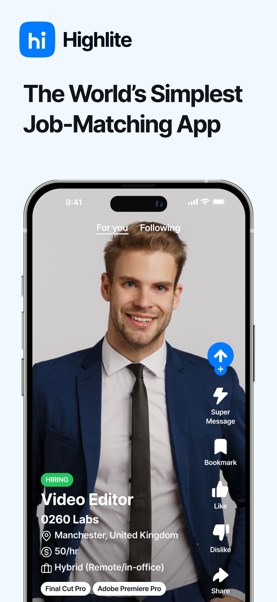
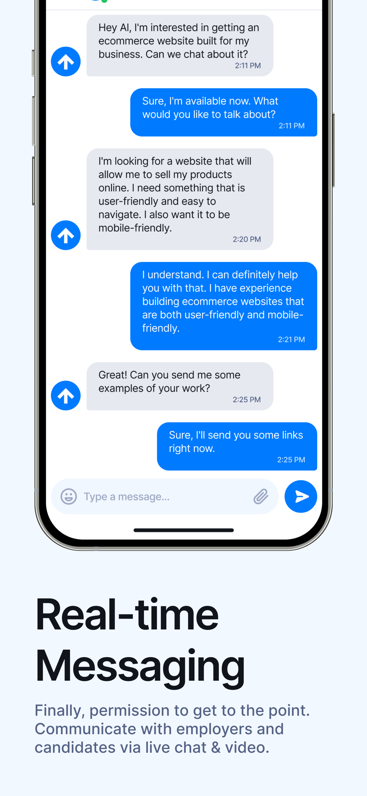
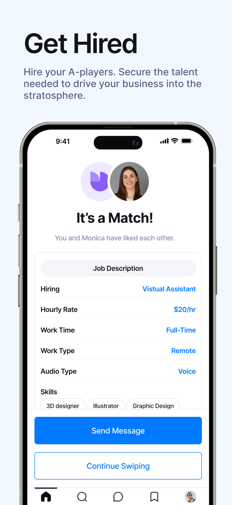
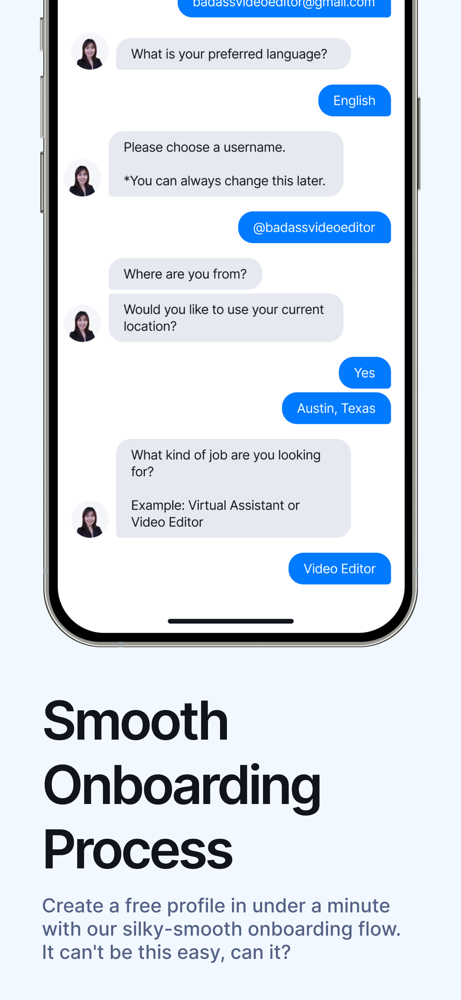

# Highlite - Candidate-Company Matching App

Highlite is a candidate-company matching app designed to streamline job seekers' and recruiters' interactions, similar to Instagram but tailored for professional networking. Built with Flutter, it provides a seamless and efficient experience for both candidates and companies.

## Features

- Candidate-Company matching
- Video-based job posts
- Candidate video profiles
- Real-time notifications
- Smooth UX/UI with Instagram-like feed
- Firebase integration for backend services

## Table of Contents

1. [Installation](#installation)
2. [Demo Video](#demo-video)
3. [Screenshots](#screenshots)
4. [Technology Stack](#technology-stack)
5. [Contributing](#contributing)
6. [License](#license)

## Installation

To run the app locally, follow these steps:

1. Clone the repository:
   ```bash
   git clone https://github.com/your-username/highlite-flutter.git
   ```
2. Navigate to the project directory:
   ```bash
   cd highlite-flutter
   ```
3. Install dependencies:
   ```bash
   flutter pub get
   ```
4. Run the app:
   ```bash
   flutter run
   ```

> Note: Make sure you have Flutter SDK and Dart installed. For more information, refer to the [Flutter documentation](https://flutter.dev/docs/get-started).

## Demo Video

Check out a demo of the Highlite app in action:

[](https://www.youtube.com/shorts/Pzp0we6RIUU)

Click on the image above or [here](https://www.youtube.com/shorts/Pzp0we6RIUU) to watch the demo video.

## Screenshots

Here are some screenshots that showcase the app’s user interface and features:

| Home Feed                           | Candidate Profile                    | Company Job Post                     |
|-------------------------------------|--------------------------------------|--------------------------------------|
|  |  |  |

| Chat Flow                           | Job Matching Flow                    | Onboarding Flow                      |
|-------------------------------------|--------------------------------------|--------------------------------------|
|  |  |  |


## Technology Stack

Highlite leverages the following technologies:

- **Flutter** - UI framework for mobile applications.
- **Firebase** - Backend services including Firestore, Authentication, and Cloud Storage.
- **Dart** - Programming language for Flutter.
- **REST API** - Communication between backend and frontend.
- **Video Player** - Integration of video features within Flutter.

## Contributing

We welcome contributions to the Highlite project! To contribute:

1. Fork the repository.
2. Create a new branch for your feature/bugfix:
   ```bash
   git checkout -b feature/your-feature-name
   ```
3. Commit your changes:
   ```bash
   git commit -m "Add your commit message"
   ```
4. Push to the branch:
   ```bash
   git push origin feature/your-feature-name
   ```
5. Open a pull request and describe your changes.

## License

Highlite is licensed under the MIT License. See the [LICENSE](LICENSE) file for more information.

---


Follow @appdeveloperr for more insights and updates!
